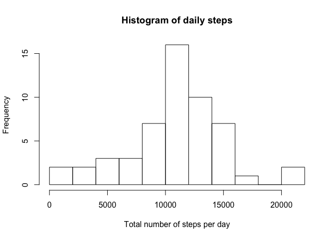
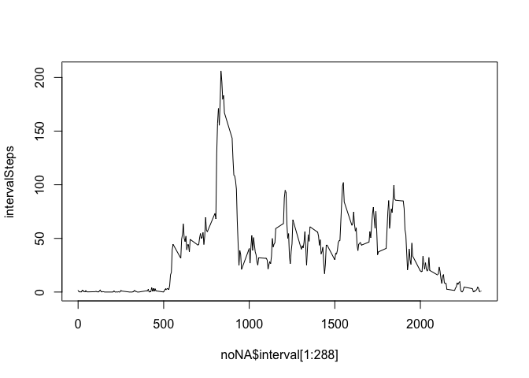
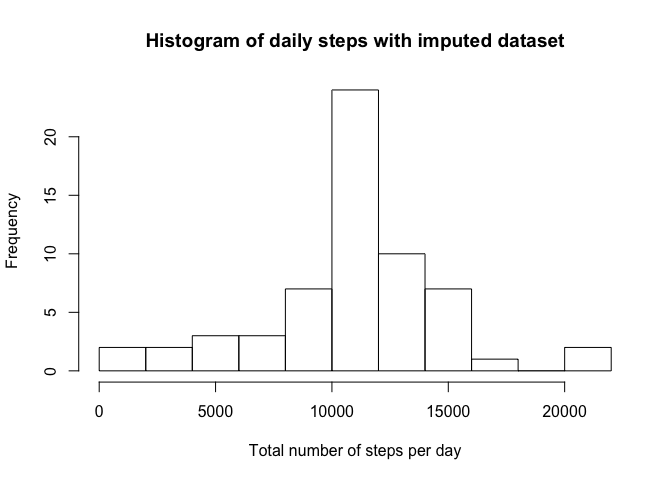
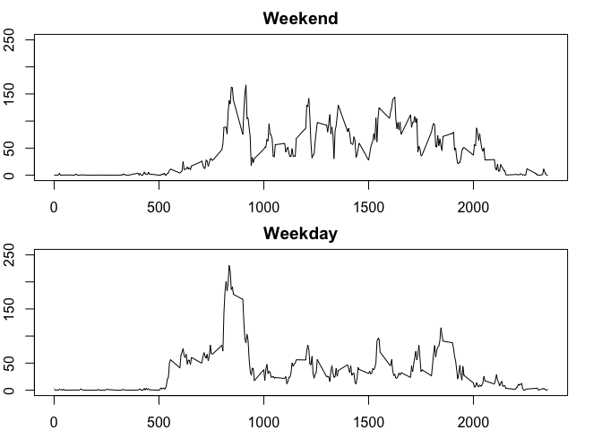

# Reproducible Research: Peer Assessment 1
Edmund Tran  
April 16, 2016  

Here is the code to load and preprocess the data. I make a version of the data that drops all of the missing values.

```r
rawdata <- read.csv("activity.csv")
noNA <- na.omit(rawdata)
```

We want to find out the mean total number of steps taken per day. First, for each day, we find the total number of steps taken and graph it in a histogram.

```r
daySteps <- tapply(noNA$steps, noNA$date, FUN = sum)
hist(daySteps, breaks = 10, xlab = "Total number of steps per day", main = "Histogram of daily steps")
```

\

To find the mean and median for daily steps, we use the "summary" function:

```r
summary(daySteps)
```

```
##    Min. 1st Qu.  Median    Mean 3rd Qu.    Max.    NA's 
##      41    8841   10760   10770   13290   21190       8
```

Now we want to see what the pattern of steps looks like in a typical day. What is the average daily activity pattern?

```r
# Time series plot of average day
intervalSteps <- tapply(noNA$steps, noNA$interval, FUN = sum)
intervalSteps <- intervalSteps/(61-8)
plot(noNA$interval[1:288], intervalSteps, type = "l")
```

\

What is the five-minute interval that has the most average steps?

```r
  # Interval with max steps
intervalSteps[intervalSteps == max(intervalSteps)]
```

```
##      835 
## 206.1698
```

Now we see that a lot of steps are taken around 8:35 AM.

There were 8 days that had missing values for all intervals. We can impute the missing values.

```r
# Imputing missing values
  # Number of NAs in the dataset
nrow(rawdata) - nrow(noNA)
```

```
## [1] 2304
```

```r
  # Impute NAs
imputedata <- rawdata
imputedata[!complete.cases(imputedata),1] <- intervalSteps
  # Histogram and averages
daySteps2 <- tapply(imputedata$steps, imputedata$date, FUN = sum)
hist(daySteps2, breaks = 10, xlab = "Total number of steps per day", main = "Histogram of daily steps with imputed dataset")
```

\

```r
summary(daySteps2)
```

```
##    Min. 1st Qu.  Median    Mean 3rd Qu.    Max. 
##      41    9819   10770   10770   12810   21190
```

The mean of imputed dataset is the same and there was an insignificant change in the median. Overall, the impact on averages are minimal to none because the imputed values came from averages.

Finally, we are interested if there is any difference in the activity pattern for weekdays and weekends.


```r
imputedata$weekday <- weekdays(as.Date(imputedata[,2]))
imputedata[imputedata$weekday == "Saturday", 4] <- "Weekend"
imputedata[imputedata$weekday == "Sunday", 4] <- "Weekend"
imputedata[imputedata$weekday != "Weekend", 4] <- "Weekday"
imputedata$weekday <- as.factor(imputedata$weekday)
weekenddata <- imputedata[imputedata$weekday == "Weekend",]
weekdaydata <- imputedata[imputedata$weekday == "Weekday",]


weekendCount <- nrow(weekenddata)/288
intervalStepsWeekend <- tapply(weekenddata$steps, weekenddata$interval, FUN = sum)
intervalStepsWeekend <- intervalStepsWeekend/weekendCount

weekdayCount <- nrow(weekdaydata)/288
intervalStepsWeekday <- tapply(weekdaydata$steps, weekdaydata$interval, FUN = sum)
intervalStepsWeekday <- intervalStepsWeekday/weekdayCount

par(mfrow = c(2,1), mar = rep(2,4))
plot(weekenddata$interval[1:288], intervalStepsWeekend, type = "l", main = "Weekend", ylab = "Number of Steps", ylim = c(0,250))
plot(weekdaydata$interval[1:288], intervalStepsWeekday, type = "l", main = "Weekday", ylab = "Number of Steps", ylim = c(0,250))
```

\
